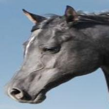
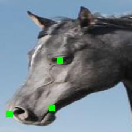

## Paper
This repository provides code for:

[Interspecies Knowledge Transfer for Facial Keypoint Detection.](https://arxiv.org/abs/1704.04023) Maheen Rashid, Xiuye Gu, Yong Jae Lee. CVPR 2017.
<p align="center">
  
  
</p>

If you find this repo useful please cite our work:
```bib
@inproceedings{rashid2016interspecies,
  title={Interspecies Knowledge Transfer for Facial Keypoint Detection},
  author={Rashid, Maheen and Gu, Xiuye and Jae Lee, Yong},
  booktitle={Proceedings of the IEEE Conference on Computer Vision and Pattern Recognition},
  year={2017}
}
```
For questions contact Maheen Rashid (mhnrashid at ucdavis dot edu)

## Getting Started

Download the code from GitHub:
```bash
git clone https://github.com/menoRashid/animal_human_kp
cd animal_human_kp
```
Install Torch. Instructions are [here](http://torch.ch/docs/getting-started.html)

Install Torch requirements:
* [torchx](https://github.com/nicholas-leonard/torchx)
```bash
luarocks install torchx
```
* [npy4th](https://github.com/htwaijry/npy4th) (You may need to checkout commit from 5-10-16)
```bash
git clone https://github.com/htwaijry/npy4th.git
cd npy4th
luarocks make
```

Install Python requirements if needed:
* [numpy](http://www.numpy.org/)
* [scipy](https://www.scipy.org/install.html)
* [matplotlib](http://matplotlib.org/users/installing.html)
* [PIL](http://www.pythonware.com/products/pil/)

Install the Spatial Tranformer module provided:
```bash
cd stnbhwd-master
luarocks make
```
It is a modification of the code from [Spatial Transformer Network (Jaderberg et al.)](https://github.com/qassemoquab/stnbhwd) and includes a Thin Plate Spline grid generator layer.

## Dataset
Download the [Horse Dataset](https://www.dropbox.com/s/9t770jhcjqo3mmg/release_data.zip) (580 MB)

Run the following commands
```bash
cd data
unzip <path to data zip file>
```

## Models
To download all the pretrained and untrained models go [here](https://www.dropbox.com/s/44ocinlmx8mp8v2/release_models.zip) (145 MB)

Run the following commands
```bash
cd models
unzip <path to models zip file>
```
Otherwise add the individual models to *models/*
* [Full model for horses with tps warping](https://www.dropbox.com/s/g0e7tj2r708eue1/horse_full_model_tps.dat)(36 MB)
* [Full model for horses with affine warping](https://www.dropbox.com/s/3vj7nts5f1v0ry0/horse_full_model_affine.dat)(63 MB)
* [TPS Warping model for horses](https://www.dropbox.com/s/3un0dild6xar8uf/horse_tps_model.dat)(34 MB)
* [Affine Warping model for horses](https://www.dropbox.com/s/o146cyvnx6hxy47/horse_affine_model.dat)(61 MB)
* [Keypoint network trained on human faces](https://www.dropbox.com/s/ksnzq43fvbsstyp/human_face_model.dat)(2.3 MB)
* [Untrained TPS Warping model](https://www.dropbox.com/s/rvqf2qtmaklvoff/tps_localization_net_untrained.dat)(23 MB)
* [Untrained Affine Warping model](https://www.dropbox.com/s/9o7mblgt1ftkebo/affine_localization_net_untrained.dat)(29 MB)

## Testing
To test pretrained model run the following commands
```bash
cd torch
th test.th -out_dir_images <path to results directory>
```
after replacing <path to results directory> with the path to the folder where you would like the output images to be saved.

A webpage with the results, a text file with the accuracy numbers, and a bar graph, would be in the results directory.
```bash
<path to results directory>/results.html
<path to results directory>/stats.txt
<path to results directory>/bar.pdf
```

## Training
The file for training the full model is 
```
torch/train_full_model.th
```
For details on training run 
```bash
cd torch
th train_full_model.th -help
```
To train the model with affine warping uncomment lines 377-378. Currently, all parameters are the parameters used in the paper.

The file for training the warping network is 
```
torch/train_warping_net.th
```
For details on training run
```bash
cd torch
th train_warping_net.th -help
```
To train the model with affine warping uncomment lines 326-327.
